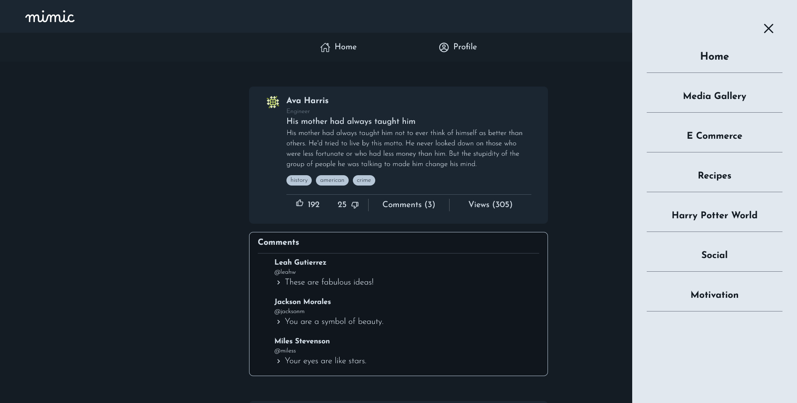

# Mimic - A multipurpose Web Application

A multi-purpose web application built with **Next.js** to showcase diverse features and functionalities, including e-commerce, media galleries, Harry Potter content, and more. This project demonstrates my skills in modular design, dynamic routing, API integration, and responsive UI development.


## 🚀 Features

- **E-Commerce Section**:

  - Authentication using JWT token
  - Product listing, product details, and navigation.
  - Dynamic routing for individual products.
  - Search product
  - Filter by category
  - Pagination
  - Add to cart functionality

**Home Page**


**Single Product**


**Checkout page**


- **Media Gallery**:

  - Photo and video galleries with **masonry grid**.
  - Filter images by category
  - Dynamically search photos and videos with prompt
  - Download media

  

- **Social Media**:

  - Authentication
  - See all posts
  - User profile

  

- **Harry Potter World**:

  - Explore charecters, books, movies, houses, and spells.
  - Dynamic pages for specific content like individual books or movies.
  - Pagination (if applicable)

  
  

- **Meal Categories**:

  - Browse recipes by category.
  - View detailed recipe pages.
  - Filter meal/recipe by category

**Home**


**Category**


**Single Recipe**


- **Quotes Section**:

  - Display and explore inspiring quotes.

  

## 🛠️ Tech Stack

- **Frontend Framework**: [Next.js](https://nextjs.org/)
- **Styling**: [Tailwind CSS](https://tailwindcss.com/)
- **API Integration**: Custom services for fetching data from APIs.

  - Dummy JSON ([Documentation](https://dummyjson.com/))
  - Pexels ([Documentation](https://www.pexels.com/api/documentation/))
  - Food ([API](https://www.themealdb.com/api.php))
  - Harry Potter World
    - Characters ([Documentation](https://hp-api.onrender.com/))
    - Harry Potter Movies ([Documentation](https://api.potterdb.com/v1/movies))
    - Houses and Spells ([Documentation](https://github.com/fedeperin/potterapi?tab=readme-ov-file))

## ⚙️ Installation and Setup

1. **Clone the repository**:

```
git clone https://github.com/Zahidul-Turja/mimic.git
cd mimic
```

2. **Install dependencies**:

```
npm install
```

3. **Set up environment variables**:
   
   Create an `.env.local` file and add `NEXT_PUBLIC_PEXELS_API_KEY` key.
   You can get your **Pexels** API key from here -> https://www.pexels.com/api/key/

5. **Run the development server**:

```
npm run dev
```

5. **Open the application in your browser**:

```
http://localhost:3000/
```

## 🌟 Highlights

- **Dynamic Routing**:
  Pages dynamically render based on route parameters (e.g., `/ecomm/products/[id]`).

- **Reusable Components**:
  Modular design ensures scalability and maintainability.

- **Responsive Design**:
  Fully responsive UI built with Tailwind CSS.

- **API Integration**:
  Data fetched dynamically using service files in`_lib/`.

## 📈 Future Enhancements

- Integrate a backend (e.g., Django) for real-time data and user management.
- Add new service categories
- Implement unit and integration tests.
- Optimize for SEO and performance.

## 🖥️ Live Demo

**Mimic** in now live. Please checkout [mimic-plum.vercel.app](https://mimic-plum.vercel.app/)
